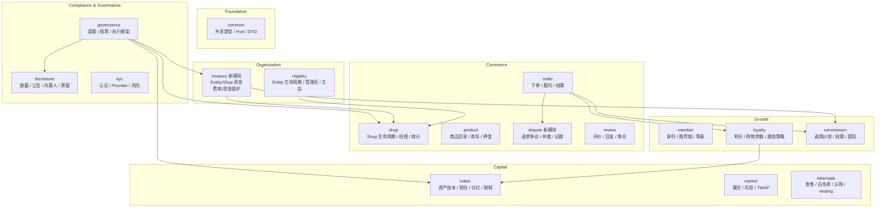

# Entity 模块组功能边界再审计（2026-03-12）

> 范围：`pallets/entity/`
> 基线：当前实际代码，而不是历史设计稿
> 目标：重新定义模块边界、补齐边界图，并把功能重新分配到更稳定的子模块/子域

## 1. 审计结论

这轮再审计的核心结论只有三条：

1. **代码已经进入“二次重构后状态”，但文档还停留在“一次重构方案”。**
   `loyalty/` 已经落地，`order/dispute.rs` 已经内部分拆，`governance` 已经抽出大量 domain port，但 README 和旧边界文档仍按“准备拆 points/dispute/loyalty”的口径描述系统。
2. **当前最大的边界问题不是“模块数量不够”，而是“职责在多个模块里各占一半”。**
   最明显的 6 组是：`registry ↔ shop ↔ treasury/fund`、`token ↔ loyalty`、`order ↔ dispute`、`commission/core ↔ treasury/fee`、`governance ↔ disclosure`、`common ↔ 各模块本地 trait`。
3. **下一阶段不应该继续“往 governance 和 common 里塞能力”，而应该把系统稳定成 6 个平面。**
   这 6 个平面分别是：`foundation`、`organization`、`commerce`、`growth`、`capital`、`compliance/governance`。

## 2. 当前真实拓扑（按代码现状，不按旧文档）

### 2.1 顶层模块快照

| 模块 | 主要职责 | `call_index` 数量 | 主要问题 |
|---|---:|---:|---|
| `common/` | 共享类型、trait、port | 0 | `traits/mod.rs` 2719 行，边界收口过度集中 |
| `registry/` | Entity 生命周期、管理员、主店、运营资金 | 25 | 混入 treasury/fund 职责 |
| `shop/` | Shop 生命周期、经理、运营资金、主店镜像 | 20 | 和 `registry`、未来 `treasury` 边界重叠 |
| `product/` | 商品目录、库存、押金、元数据 pin | 10 | 相对清晰，可保持 |
| `order/` | 下单、履约、结算、退款、争议入口 | 25 | dispute 仍是订单内子域 |
| `review/` | 评价、回复、评分聚合 | 5 | 相对清晰，可保持 |
| `token/` | 资产桥接、锁仓、分红、转账限制、奖励/折扣 | 28 | 同时承担资产账本 + 激励策略 |
| `market/` | 撮合、订单簿、TWAP、熔断、KYC 门控 | 27 | 单 crate 过大，但域边界仍可保持 |
| `tokensale/` | 发售轮次、白名单、认购、退款、归属解锁 | 27 | 与 token vesting 存在边界交叉 |
| `member/` | 会员、推荐链、等级、审批、升级规则 | 31 | 身份域过宽 |
| `loyalty/` | Shop 积分、NEX 购物余额、Token 激励入口 | 10 | 已落地，但和 token 仍是双中心 |
| `commission/core` | 返佣引擎、提现、购物余额协作、资金提取 | 28 | 混入 treasury/fee 能力 |
| `governance/` | 提案、投票、执行、跨域治理 port | 16 | `ProposalType` 已膨胀到 88 个变体 |
| `disclosure/` | 披露、公告、内幕人、黑窗、处罚 | 39 | 业务独立，但与 governance 协作过重 |
| `kyc/` | KYC 等级、provider、风险评分、过期 | 25 | 功能清晰，但 port 使用未统一 |

### 2.2 当前最真实的“已完成重构”

下面这些事情其实已经在代码里发生了：

- `loyalty/` 已经承接了 **Shop 积分** 和 **NEX 购物余额**。
- `order/` 已经把争议/退款主流程抽到 `order/src/dispute.rs`，只是还没独立成单独 pallet。
- `governance/` 已经不再直接硬编码所有跨域逻辑，而是依赖 `MarketGovernancePort`、`ShopGovernancePort`、`TokenGovernancePort`、`KycGovernancePort` 等 port。
- `common/` 的 `lib.rs` 已经被拆薄，但大块复杂度又集中到了 `traits/mod.rs`。

也就是说，系统现在的问题不是“完全没分层”，而是**第一轮重构已经开始，但只做了一半**。

## 3. 六个真实越界点

### 3.1 `registry` 与 `shop` 共同维护 Entity/Shop 聚合状态

当前至少有三类聚合状态被拆成了双写：

- `registry` 里 `Entity.primary_shop_id`
- `shop` 里 `EntityPrimaryShop`
- `registry`、`shop` 都暴露了 `set_primary_shop`

这会让“主店是谁”这个事实出现两个来源。`primary_shop_id` 作为 **Entity 聚合属性**，应该只能由 `registry` 持有；`shop` 只能查询，不能再镜像一份。

### 3.2 资金域被拆成三块：`registry`、`shop`、`commission/core`

现在“钱”的职责分散在三个地方：

- `registry`：Entity 运营资金、充值、健康度
- `shop`：Shop 运营资金、提现、暂停阈值
- `commission/core`：Entity 资金提取、Token 资金提取、Token 平台费率

这说明系统缺的不是另一个业务模块，而是一个真正的 **treasury/fund 子域**。只要资金和费率继续分散，订单、返佣、治理都要依赖多个来源。

### 3.3 `token` 与 `loyalty` 形成“激励双中心”

`loyalty/` 已经成为激励入口，但 `token/` 仍保存：

- `reward_rate`
- `exchange_rate`
- `min_redeem`
- `max_redeem_per_order`
- `reward_on_purchase`
- `redeem_for_discount`

结果就是：

- **积分/NEX 购物余额** 在 `loyalty`
- **Token 折扣/奖励策略** 仍在 `token`

这使得“用户激励”没有唯一 owner。正确边界应当是：

- `token` 只拥有 **资产账本与资产规则**
- `loyalty` 拥有 **激励策略、折扣规则、奖励策略、积分策略**
- `loyalty` 通过 asset port 调用 `token`，而不是反过来

### 3.4 `order` 已经拆出 `dispute.rs`，但争议域还没真正独立

现在的实现方式更像“订单内部子模块”，还不是“独立争议域”：

- 争议状态仍写回 `Order.status`
- 争议超时仍复用订单过期队列
- `registry` 已经依赖 `DisputeQueryProvider` 做关闭前检查，但当前 entity 模块组内并没有对应实现落地

说明系统已经承认“争议是独立能力”，但模型和 provider 还没真正抽出来。

### 3.5 `governance` 太大，`disclosure` 又太独立

当前最不合理的组合不是“是否合并 disclosure”，而是：

- `governance` 的 `ProposalType` 已经达到 88 个变体
- `disclosure` 自身又保留了完整的披露、内幕人、公告、处罚、审批流

如果直接把 `disclosure` 合并进 `governance`，只会把一个过大的治理 pallet 变得更大。更合理的边界是：

- `governance` 负责 **提案/投票/执行框架**
- `disclosure` 负责 **合规状态机与披露资产**
- 两者通过 `DisclosureWriteProvider` / `DisclosureReadProvider` 协作

也就是“协作收口”，不是“物理合并”。

### 3.6 `member` 同时承载身份、推荐链、等级引擎、审批流、统计

`member/` 当前实际上包含 4 个子域：

1. 会员注册 / 审批
2. 推荐关系图
3. 等级系统 / 升级规则
4. 会员统计与消费累积

这 4 件事仍然可以放在一个 pallet 里，但不能继续放在一个 `lib.rs` 里。这里的问题更偏向 **模块内边界失衡**，不是一定要拆成多个顶层 pallet。

### 3.7 `common` 成为了“接口垃圾回收站”

`common/src/traits/mod.rs` 已经 2719 行，且出现多处“本应由 common 统一，却又在业务 pallet 本地重复定义”的情况：

- `member` 自己定义 `KycChecker`
- `tokensale` 自己定义 `KycChecker`
- `token` 自己定义 `KycLevelProvider` / `EntityMemberProvider`
- `common` 同时已经有 `KycProvider`、`MemberProvider`

这类重复 trait 会让 runtime 适配层越来越厚，也让“模块真实边界”越来越模糊。

## 4. 重新定位后的目标边界

### 4.1 顶层平面划分



### 4.2 每个顶层模块的最终职责

### `common/`

只保留三类内容：

- 跨域共享类型（Entity/Shop/Order/Token 等 DTO）
- 最小可复用 port（read/write/query/command）
- 通用错误与分页

**不再接受**：

- 业务策略枚举不断追加
- 只被单个 pallet 使用的本地 trait
- 历史兼容接口无限叠加

### `registry/`

保留：

- Entity 创建、关闭、重开、状态迁移
- owner/admin 权限位管理
- 主店唯一真相（`primary_shop_id`）
- Entity → Shop 列表映射
- Entity 类型 / 治理模式 / 推荐人绑定

迁出：

- 所有 fund/treasury 余额与费率逻辑
- 资金健康度计算

### `treasury/`（新增）

统一承接资金和费率：

- Entity 运营资金
- Shop 运营资金
- 平台费率 / Token 平台费率
- Entity/Token 提取
- Commission/Loyalty 预留资金保护
- `FeeConfigProvider` / `EntityTreasuryPort` / `CommissionFundGuard` 收口

这是这轮重构中最应该新增的模块。

### `shop/`

保留：

- Shop 创建、更新、暂停、恢复、关闭
- Shop manager 管理
- 地理位置 / 政策 / 类型
- 销售额、订单数、评分等 shop 统计

迁出：

- `EntityPrimaryShop` 镜像存储
- `set_primary_shop`
- 运营资金余额与提现逻辑（迁到 `treasury/`）

### `product/`

保持不拆顶层边界，内部可整理为：

- `catalog.rs`：商品基本信息
- `inventory.rs`：库存与上下架
- `deposit.rs`：押金与强制下架
- `storage.rs`：IPFS pin

### `order/`

保留：

- place / cancel / ship / confirm / service complete
- 支付结算与退款出金入口
- 订单索引、过期队列、买家/付款人/店铺关系
- 对 loyalty / commission / member 的通知编排

迁出：

- 争议状态机
- 证据、仲裁、争议超时、裁决结果

### `dispute/`（新增）

承接：

- `request_refund`
- `approve_refund`
- `reject_refund`
- `withdraw_dispute`
- `force_refund`
- `force_partial_refund`
- `force_complete`
- dispute evidence / resolution / deadline / arbitration

`order/` 只保存 `dispute_id` 或 `has_active_dispute`，不再把 dispute 当作订单主状态机的一部分。

### `review/`

保持评价域独立，不再承载任何仲裁职责。需要审核/删除时，只调用 dispute/compliance port，不自己演化仲裁逻辑。

### `member/`

顶层 pallet 继续保留，但内部必须拆成 4 个子模块：

- `registration.rs`：注册、审批、封禁、移除
- `referral.rs`：推荐关系图、团队大小、qualified referral
- `level.rs`：等级体系、自定义等级、等级失效
- `upgrade_rule.rs`：升级规则、冲突策略、触发记录

这样可以避免继续把身份域写成“第二个 common”。

### `loyalty/`

把它真正做成 **唯一激励域**，内部拆成：

- `points.rs`：Shop 积分
- `shopping_balance.rs`：NEX 购物余额
- `token_incentive.rs`：Token 折扣 / 购物奖励策略

同时从 `token/` 迁入：

- `reward_rate`
- `exchange_rate`
- `min_redeem`
- `max_redeem_per_order`
- `reward_on_purchase`
- `redeem_for_discount`

### `token/`

收缩成纯资产域：

- 资产创建/元数据
- mint / burn / transfer / lock / unlock
- dividend
- transfer restriction / whitelist / blacklist
- vesting/lock 账本

不再承担：

- 购物激励策略
- 折扣兑换策略

### `commission/`

保留顶层 plugin 架构，但把 `core/` 拆成：

- `config.rs`：返佣模式/提现配置
- `engine.rs`：订单返佣计算与落账
- `settlement.rs`：订单完成/取消后的核销与转账
- `withdraw.rs`：提现
- `reserve.rs`：与 `treasury` / `loyalty` 的预留校验

迁出 `core/`：

- `withdraw_entity_funds`
- `withdraw_entity_token_funds`
- `TokenPlatformFeeRate`

这些都应归 `treasury/`。

### `market/`

顶层边界可保持，但内部必须拆 4 子域：

- `engine.rs`：挂单、撮合、取消、修改
- `orderbook.rs`：价格档位、深度快照
- `oracle.rs`：TWAP / 快照
- `risk.rs`：熔断、KYC、黑窗、价格保护

### `tokensale/`

顶层边界保留，但需要明确：

- `tokensale` 只管理 **sale-round vesting**
- `token` 只管理 **asset-level lock/vesting ledger**

后续两者必须通过 `VestingProvider`/`TokenProvider` 对齐，不能各自维护一套“看起来像 vesting”的抽象。

### `governance/`

只保留：

- 提案生命周期
- 投票、委托、否决、终结
- 域命令执行框架（通过 port 调用下游）

不再扩张：

- 继续增加超长 `ProposalType` 枚举
- 直接内嵌 disclosure/market/commission 具体业务字段

建议把 `ProposalType` 改成：

- `ProposalDomain`
- `CommandId`
- `payload_cid` 或轻量 payload

让具体参数由域模块自行解释。

### `disclosure/`

保持独立顶层模块，但定位收缩为 **合规状态机**：

- 披露配置与披露记录
- 公告系统
- 内幕人和黑窗
- 处罚等级与违规计数

治理只通过 provider 调它，而不是吞掉它。

### `kyc/`

保持独立，重点是把所有本地 `KycChecker`/`KycLevelProvider` 统一收口到 `common::KycProvider`。

## 5. 功能重分配矩阵

| 来源模块 | 迁出功能 | 目标模块 |
|---|---|---|
| `registry/` | `top_up_fund`、资金健康度、`FeeType` | `treasury/` |
| `shop/` | `fund_operating`、`withdraw_operating_fund`、运营余额 | `treasury/` |
| `shop/` | `EntityPrimaryShop`、`set_primary_shop` | `registry/` |
| `token/` | 奖励率、兑换率、折扣/奖励逻辑 | `loyalty/token_incentive.rs` |
| `order/` | dispute/退款裁决流程 | `dispute/` |
| `commission/core` | Entity/Token 资金提取、Token 平台费率 | `treasury/` |
| `member/lib.rs` | 注册、推荐、等级、规则混写 | `member/*` 内部 4 子模块 |
| `market/lib.rs` | 撮合、订单簿、预言机、风控混写 | `market/*` 内部 4 子模块 |
| `governance/lib.rs` | 超长业务 payload | 各域模块 + port 执行 |
| `member/token/tokensale` | 本地 KYC trait | `common::KycProvider` |

## 6. 新的功能边界图（职责视角）

```text
Foundation
└── common
    ├── types
    ├── ports
    ├── errors
    └── pagination

Organization
├── registry      : entity 生命周期 / owner-admin / primary shop
└── treasury      : entity-shop 资金 / 费率 / 提取 / 保护余额

Commerce
├── shop          : shop 生命周期 / manager / metadata / stats
├── product       : catalog / inventory / deposit / pin
├── order         : place / pay / fulfill / settle
├── dispute       : refund dispute / evidence / arbitration
└── review        : review / reply / score aggregate

Growth
├── member        : identity / referral / level / upgrade rules
├── loyalty       : points / shopping balance / token incentive
└── commission    : plan / engine / settlement / withdraw

Capital
├── token         : asset ledger / lock / dividend / restriction
├── market        : matching / orderbook / oracle / risk
└── tokensale     : round / whitelist / subscribe / claim / vesting

Compliance & Governance
├── governance    : proposal / vote / delegate / execute
├── disclosure    : disclosure / announcement / insider / blackout
└── kyc           : provider / level / risk / expiry
```

## 7. 实施优先级

### P0（先做，风险最低，收益最大）

1. `common` 拆分 trait 文件，统一 KYC / Member / Fee / Treasury port。
2. 删除 `shop` 内的 `EntityPrimaryShop` 镜像，把主店唯一真相收回 `registry`。
3. 让 `README` 和边界文档先对齐真实代码状态，停止“文档说要拆，代码其实已经拆了”的漂移。

### P1（第二阶段，边界真正收口）

1. 新增 `treasury/`，把 `registry + shop + commission/core` 的资金/费率职责收口。
2. 把 `token` 中激励相关字段和方法迁入 `loyalty`。
3. 让 `order` 只保留履约与结算，不再拥有完整 dispute 状态机。

### P2（第三阶段，模块内重构）

1. `member/lib.rs` 内部分文件。
2. `market/lib.rs` 内部分文件。
3. `governance/lib.rs` 改成命令式执行框架，压缩 `ProposalType` 体积。

### P3（第四阶段，协议级统一）

1. `tokensale` 与 `token` 的 vesting/lock 模型对齐。
2. `disclosure` 与 `governance` 通过 read/write provider 明确边界。
3. 所有 runtime 适配层只绑定 `common` port，不再绑定业务 pallet 私有 trait。

## 8. 最终建议

如果只选一个本轮最关键动作，我建议优先做：

**先落 `treasury/`，再收 `token → loyalty`，最后把 `order → dispute` 拆干净。**

原因很简单：

- 钱的边界不稳定，所有模块都会继续互相借字段、借存储、借费率。
- 激励的边界不稳定，`order`/`commission`/`token`/`loyalty` 会继续互相穿透。
- 争议的边界不稳定，`registry` 的关闭检查、`order` 的状态机、未来治理仲裁都会一直扭在一起。

换句话说，这次不应该再从“画更多模块图”开始，而应该从 **把钱、激励、争议这三条主线各自收口到唯一 owner** 开始。
